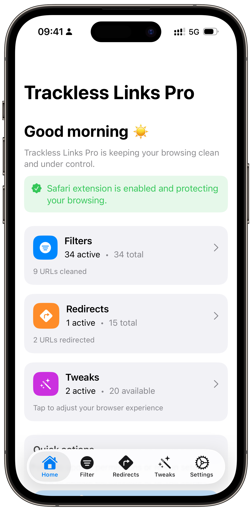
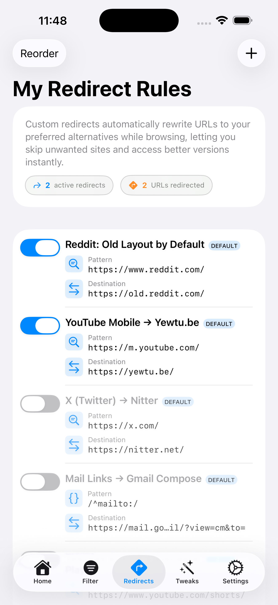
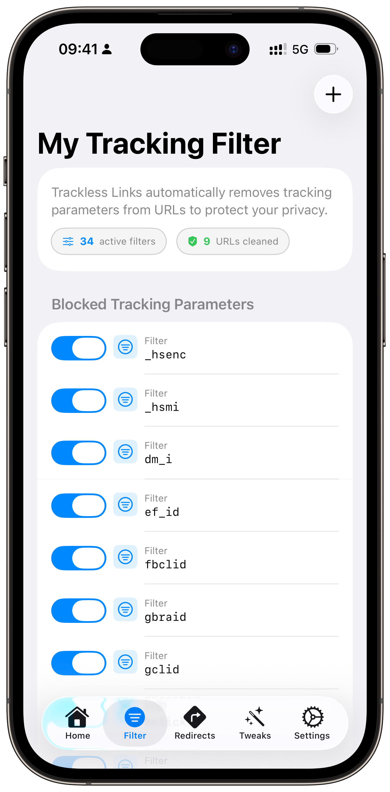
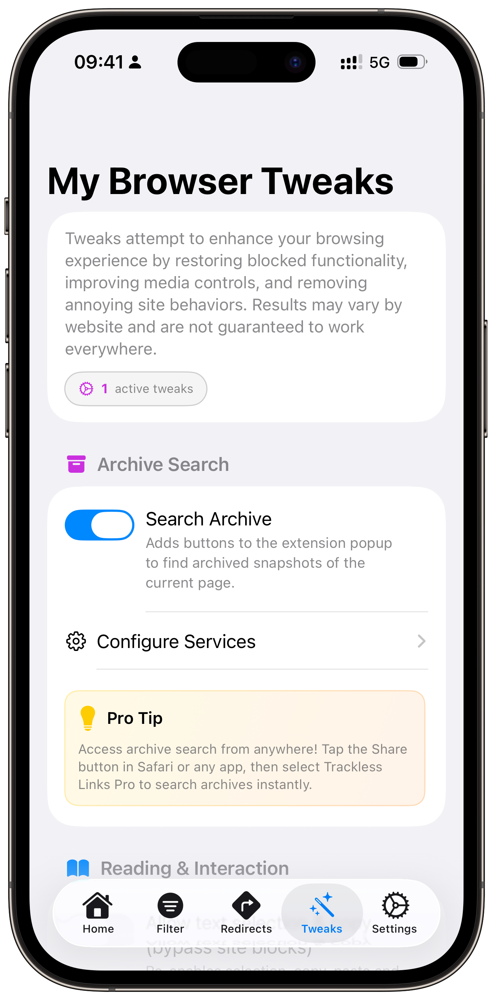

🇺🇸 **English** | 🇩🇪 [Deutsch](README_de.md) | 🇯🇵 [日本語](README_ja.md) | 🇨🇳 [中文](README_zh-Hans.md)

# Trackless Links – Safari Extension for Privacy, URL Cleaning & Tracker Blocking

  

**The Safari extension that removes tracking codes, redirects annoying sites, and restores website functionality you've been missing.**

Tired of sharing messy URLs full of `?utm_source=...` tracking garbage? Frustrated by websites that block text selection or force autoplay videos? Trackless Links fixes all of this automatically – and it runs 100% on your device with zero data collection.

Built with a clean, modern design, Trackless Links feels light and powerful on iPhone, iPad, and Mac.

---

## 🚀 Download Now

### Trackless Links Pro — Best for Mac Users
**One purchase. iPhone + iPad + Mac.** Full feature set with seamless iCloud sync across all your Apple devices.

### Trackless Links — Best for iPhone & iPad
Complete privacy protection and browsing control for iOS.

---

## ✨ What Makes Trackless Links Different?

Most "privacy" extensions just block ads. Trackless Links does more – it cleans your URLs, redirects you away from tracking-heavy sites, and fixes broken website behaviors. All without sending a single byte of data to any server.

### 🛡️ Automatic Tracker Removal

Stop sharing links that expose your browsing habits.

- **Strips tracking parameters** like `utm_source`, `fbclid`, `gclid`, `mc_eid` from every URL
- **Pre-loaded blocklist** with 50+ common tracking codes
- **Add your own rules** for complete customization
- **Real-time statistics** show exactly how many trackers you've blocked

### 🔀 Smart URL Redirects

Skip annoying sites automatically.

- **Reddit → Old Reddit** – Escape the redesign
- **Twitter/X → XCancel** – Privacy-respecting alternative
- **YouTube → Invidious** – Ad-free viewing
- **Instagram → Imginn** – View without login
- **Google Maps → Apple Maps** – Native maps experience
- **20+ built-in redirects** focusing on privacy and speed
- **Create custom rules** with plain text or regex
- **Drag-and-drop priority** – Your rules, your order

### ⚡ Browser Tweaks That Actually Work

Restore the web functionality that sites try to break.

- **Force text selection** on sites that block copying
- **Enable right-click menus** everywhere
- **Block autoplay videos** across all sites
- **Force Picture-in-Picture** on any video
- **Remove "Are you sure you want to leave?" popups**
- **Apply dark mode** to any website with smart color inversion
- **Lock playback speed** so videos don't reset to 1x

### 🔍 Source Credibility — Know Before You Click

Get warned when visiting sites known for misinformation, fake news, or conspiracy theories.

- **Powered by [CRED-1](https://github.com/aloth/cred-1)** – Open, peer-reviewed dataset of 2,672 flagged domains
- **Tiered warning banners** – High risk (red), elevated (orange), moderate (yellow)
- **Dismiss or go back** – One tap to ignore per site or navigate to safety
- **100% on-device** – No browsing data sent anywhere
- **Off by default** – Enable when you're ready in the Credibility tab

### 📦 Web Archive Search

Find deleted or changed content instantly.

- **One-tap Wayback Machine access** from Safari toolbar
- **Multiple archive services** configurable
- **Smart URL cleaning** for better match rates
- **Works from Share Sheet** in any app

### 📤 Works Everywhere You Browse

- **Share Sheet integration** – Clean links from Reddit, Twitter, email, anywhere
- **iCloud Sync** – Settings sync instantly across iPhone, iPad, and Mac
- **Instant Safari integration** – Changes apply immediately

---

## 📱 Screenshots

<table>
<tr>
<td width="50%">

### 🏠 Privacy Dashboard
Real-time statistics showing blocked trackers, applied redirects, and bandwidth saved. Clean Liquid Glass design for iPhone, iPad, and Mac.

</td>
<td width="50%">

### 🔀 Custom Redirect Rules
Powerful URL redirect management with drag-and-drop reordering. Supports exact match and regex patterns.

</td>
</tr>
<tr>
<td width="50%">

### 🛡️ Tracking Parameter Filter
Comprehensive blocklist for URL tracking codes. Pre-loaded with utm_source, fbclid, gclid and 50+ more.

</td>
<td width="50%">

### ⚡ Browser Enhancement Tweaks
Restore disabled website features. Enable text selection, right-click menus, video controls, and remove browsing restrictions.

</td>
</tr>
</table>

---

## 🔒 Privacy You Can Trust

**We can't see your data because we never receive it.**

- ✅ **100% on-device processing** – Nothing leaves your iPhone, iPad, or Mac
- ✅ **Zero data collection** – No analytics, no tracking, no servers
- ✅ **No account required** – Works immediately after install
- ✅ **Optional iCloud Sync** – Uses YOUR iCloud, not ours (disabled by default)
- ✅ **Open development** – Bug reports and feature requests on GitHub

[Read the full Privacy Policy →](https://github.com/aloth/trackless-links/blob/main/privacy_policy.md)

---

## 🛠️ Support & Feedback

Help make Trackless Links better:

- 🐛 [Report a Bug](https://github.com/aloth/trackless-links/issues/new?template=bug-report.md)
- 💡 [Request a Feature](https://github.com/aloth/trackless-links/issues/new?template=feature_request.md)

---

## 📖 FAQ & User Guide

New to URL tracking? Want to understand how privacy protection works? Check out the comprehensive FAQ:

- [FAQ (English)](FAQ.md)
- [FAQ (Deutsch)](FAQ_de.md)
- [FAQ (日本語)](FAQ_ja.md)
- [FAQ (简体中文)](FAQ_zh-Hans.md)

---

## 🌍 Available Languages

Trackless Links is fully localized in:

- 🇺🇸 English
- 🇩🇪 [Deutsch (German)](README_de.md)
- 🇯🇵 [日本語 (Japanese)](README_ja.md)
- 🇨🇳 [简体中文 (Chinese Simplified)](README_zh-Hans.md)

---

## �️ Keywords

Safari extension, tracker blocker, URL cleaner, privacy extension, remove utm parameters, block fbclid, Safari privacy, iOS privacy app, Mac privacy tool, URL redirect, content blocker, anti-tracking, clean links, share clean URLs, Wayback Machine, web archive search, block autoplay, force dark mode, Picture-in-Picture, text selection, right-click menu

---

## Related Projects

- [**Mindful Coffee**](https://github.com/aloth/mindful-coffee) — Smart caffeine tracking with sleep prediction & cortisol rhythm modeling
- [**Mindful Body**](https://github.com/aloth/mindful-body) — Body composition tracker with HealthKit, iCloud sync & progress photos

---

**Stop sharing tracking links. Start browsing privately.**

**[Get Trackless Links Pro](https://apps.apple.com/us/app/trackless-links-pro/id6754613166)** (iPhone, iPad, Mac) or **[Trackless Links](https://apps.apple.com/us/app/trackless-links-extension/id6749830894)** (iPhone, iPad)
