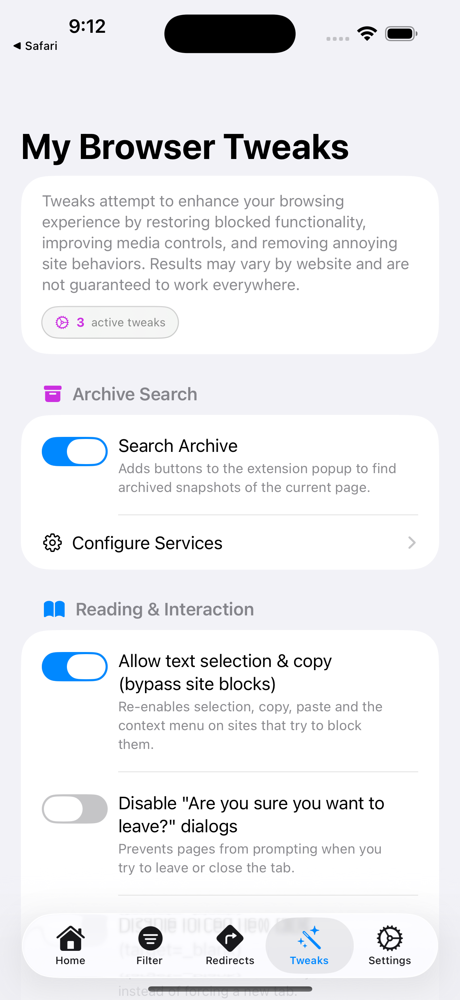

# Trackless Links: Complete Browsing Control for Safari
Browse privately, skip unwanted sites, and take control of your web experience.

Trackless Links is a comprehensive Safari Extension for iOS that transforms how you browse the web. It automatically removes tracking parameters for privacy, redirects you away from unwanted sites to better alternatives, and restores website functionality that sites often break or disable.

Crafted with the Liquid Glass design language, the entire experience feels light, tactile, and right at home on the latest iPhone lineup.

## ✨ Key Features

### 🛡️ Privacy Protection
* **Automatic Tracker Removal**: Silently strips tracking parameters (utm_source, fbclid, gclid, etc.) from URLs as you browse
* **Comprehensive Blocklist**: Pre-loaded with common tracking parameters, fully customizable
* **Clean Link Sharing**: Share shorter, cleaner URLs without tracking codes
* **Privacy Statistics**: Track blocked trackers and applied redirects

### 🔀 Smart Redirects
* **Skip Unwanted Sites**: Automatically redirect to better alternatives (Reddit → old.reddit.com, Twitter → Nitter, etc.)
* **Custom Rules**: Create your own redirect patterns with exact matches or regex support
* **Browse Your Way**: Take control of where links actually take you
* **Drag-and-Drop Reordering**: Easily prioritize redirects by reordering them with drag-and-drop

### ⚡ Browsing Enhancements
* **Restore Blocked Functionality**: Re-enable text selection, copying, and right-click menus on sites that disable them
* **Media Control**: Show native video/audio controls, block autoplay, set default playback speeds
* **Remove Annoyances**: Disable "Are you sure you want to leave?" dialogs, prevent forced new tabs, and more
* **Clean User Interface**: Completely redesigned interface with improved navigation and cleaner layouts

### 📦 Archive Search
* **One-Tap Archive Access**: Quickly find cached versions of web pages directly from the extension popup
* **Wayback Machine Integration**: Access archived web page snapshots with a single tap
* **Expandable Service Support**: Add additional archive services if needed
* **Find Lost Content**: View archived snapshots of changed or deleted pages with ease

## 📱 Screenshots

Experience the beautifully crafted interface across all key features:

<table>
<tr>
<td width="50%">

### 🏠 Dashboard & Analytics
Real-time privacy protection insights with live statistics tracking blocked trackers, applied redirects, and bandwidth saved. Clean Liquid Glass design optimized for modern iPhones.

</td>
<td width="50%">

### 🔀 Custom Redirect Rules
Powerful redirect management with drag-and-drop reordering. Create custom rules to automatically redirect unwanted sites to better alternatives with exact match or regex support.

</td>
</tr>
<tr>
<td width="50%">

### 🛡️ Tracking Filter Management
Comprehensive tracking parameter blocklist with full customization. Pre-loaded with common tracking codes (utm_source, fbclid, gclid) and easily extendable for your needs.

</td>
<td width="50%">

### ⚡ Browser Enhancement Tweaks
Restore website functionality that sites often disable. Re-enable text selection, right-click menus, video controls, and remove annoying browsing restrictions.

</td>
</tr>
</table>

## 🚀 Get the App
[Download Trackless Links from the App Store](https://apps.apple.com/us/app/trackless-links-extension/id6749830894?platform=iphone) and transform your browsing experience today.

## 🔒 Privacy by Design
Your privacy and control are the core features of this app:

* **100% Local Processing**: All URL cleaning, redirecting, and tweaks happen on your device
* **Zero Data Collection**: We never see, collect, store, or transmit your browsing data
* **No Servers Required**: No external services or cloud processing
* **Your Data Stays Yours**: Complete privacy protection by design

[Read the full Privacy Policy](https://github.com/aloth/trackless-links/blob/main/privacy_policy.md)

## 🛠️ Support & Feedback
Help us make Trackless Links even better! We welcome your feedback and ideas:

* **Report a Bug**: [Submit a bug report](https://github.com/aloth/trackless-links/issues/new?template=bug-report.md)
* **Request a Feature**: [Suggest new functionality](https://github.com/aloth/trackless-links/issues/new?template=feature_request.md)

## 🌍 Localization
Trackless Links is available in English and German (Deutsch), with more languages planned for future releases.

---

**Browse with privacy, control, and confidence. Get Trackless Links today!**
