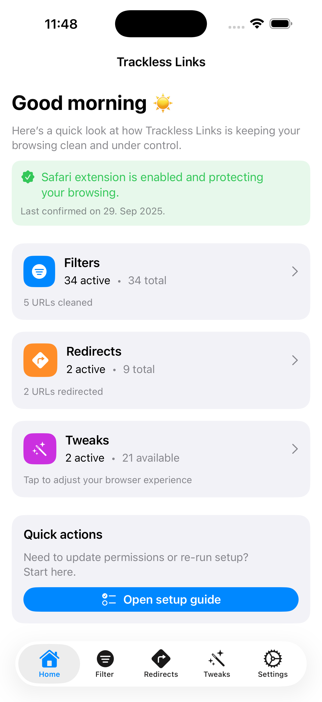
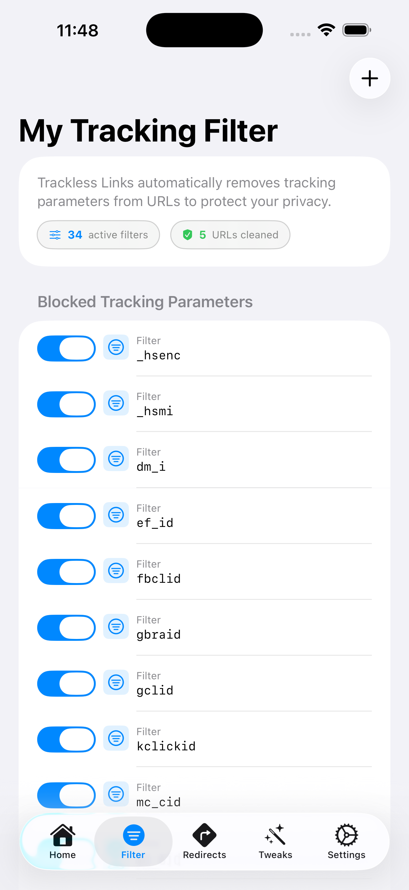

# Trackless Links – Safari-Erweiterung für Datenschutz, URL-Bereinigung & Tracker-Blockierung

  

**Die Safari-Erweiterung, die Tracking-Codes entfernt, nervige Seiten umleitet und Website-Funktionen wiederherstellt, die du vermisst hast.**

Genug von hässlichen URLs voller `?utm_source=...` Tracking-Müll? Frustriert von Websites, die Textauswahl blockieren oder Videos automatisch abspielen? Trackless Links behebt all das automatisch – und läuft zu 100% auf deinem Gerät, ohne Datensammlung.

Mit einem klaren, modernen Design fühlt sich Trackless Links leicht und leistungsstark an auf iPhone, iPad und Mac.

---

## 🚀 Jetzt herunterladen

### Trackless Links Pro — Ideal für Mac-Nutzer
**Ein Kauf. iPhone + iPad + Mac.** Voller Funktionsumfang mit nahtloser iCloud-Synchronisierung über alle Apple-Geräte.

### Trackless Links — Ideal für iPhone & iPad
Vollständiger Datenschutz und Browsing-Kontrolle für iOS.

---

## ✨ Was macht Trackless Links besonders?

Die meisten „Datenschutz"-Erweiterungen blockieren nur Werbung. Trackless Links kann mehr – es säubert deine URLs, leitet dich weg von Tracking-lastigen Seiten und repariert kaputte Website-Funktionen. Alles ohne ein einziges Byte an irgendeinen Server zu senden.

### 🛡️ Automatische Tracker-Entfernung

Schluss mit Links, die dein Surfverhalten verraten.

- **Entfernt Tracking-Parameter** wie `utm_source`, `fbclid`, `gclid`, `mc_eid` aus jeder URL
- **Vorinstallierte Sperrliste** mit über 50 gängigen Tracking-Codes
- **Eigene Regeln hinzufügen** für vollständige Anpassung
- **Echtzeit-Statistiken** zeigen genau, wie viele Tracker blockiert wurden

### 🔀 Intelligente URL-Weiterleitungen

Überspringe nervige Seiten automatisch.

- **Reddit → Old Reddit** – Entkomme dem Redesign
- **Twitter/X → XCancel** – Datenschutzfreundliche Alternative
- **YouTube → Invidious** – Werbefreies Ansehen
- **Instagram → Imginn** – Ansehen ohne Login
- **Google Maps → Apple Maps** – Native Karten-Erfahrung
- **20+ eingebaute Weiterleitungen** mit Fokus auf Datenschutz und Geschwindigkeit
- **Eigene Regeln erstellen** mit Text oder Regex
- **Drag-and-Drop-Priorität** – Deine Regeln, deine Reihenfolge

### ⚡ Browser-Tweaks, die wirklich funktionieren

Stelle die Web-Funktionen wieder her, die Seiten gerne kaputt machen.

- **Textauswahl erzwingen** auf Seiten, die Kopieren blockieren
- **Rechtsklick-Menüs aktivieren** überall
- **Autoplay-Videos blockieren** auf allen Seiten
- **Bild-in-Bild erzwingen** für jedes Video
- **„Seite wirklich verlassen?"-Popups entfernen**
- **Dark Mode anwenden** auf jede Website mit intelligenter Farbumkehrung
- **Wiedergabegeschwindigkeit fixieren** damit Videos nicht auf 1x zurückspringen

### 📦 Web-Archiv-Suche

Finde gelöschte oder geänderte Inhalte sofort.

- **Ein-Tipp-Zugriff auf Wayback Machine** aus der Safari-Toolbar
- **Mehrere Archivdienste** konfigurierbar
- **Intelligente URL-Bereinigung** für bessere Trefferquoten
- **Funktioniert aus dem Share Sheet** in jeder App

### 📤 Funktioniert überall, wo du surfst

- **Share Sheet-Integration** – Links säubern aus Reddit, Twitter, E-Mail, überall
- **iCloud-Synchronisierung** – Einstellungen synchronisieren sofort zwischen iPhone, iPad und Mac
- **Sofortige Safari-Integration** – Änderungen greifen unmittelbar

---

## 📱 Screenshots

<table>
<tr>
<td width="50%">

### 🏠 Datenschutz-Dashboard
Echtzeit-Statistiken mit blockierten Trackern, angewendeten Weiterleitungen und gespartem Datenvolumen. Klares Liquid Glass-Design für iPhone, iPad und Mac.

</td>
<td width="50%">

### 🔀 Eigene Weiterleitungsregeln
Leistungsstarke URL-Weiterleitungsverwaltung mit Drag-and-Drop. Unterstützt exakte Übereinstimmung und Regex-Muster.

</td>
</tr>
<tr>
<td width="50%">

### 🛡️ Tracking-Parameter-Filter
Umfassende Sperrliste für URL-Tracking-Codes. Vorinstalliert mit utm_source, fbclid, gclid und über 50 weiteren.

</td>
<td width="50%">

### ⚡ Browser-Verbesserungs-Tweaks
Deaktivierte Website-Funktionen wiederherstellen. Textauswahl, Rechtsklick-Menüs, Video-Steuerung aktivieren und Surf-Beschränkungen entfernen.

</td>
</tr>
</table>

---

## 🔒 Datenschutz, dem du vertrauen kannst

**Wir können deine Daten nicht sehen, weil wir sie nie erhalten.**

- ✅ **100% Verarbeitung auf dem Gerät** – Nichts verlässt dein iPhone, iPad oder Mac
- ✅ **Keine Datensammlung** – Keine Analysen, kein Tracking, keine Server
- ✅ **Kein Account nötig** – Funktioniert sofort nach der Installation
- ✅ **Optionale iCloud-Synchronisierung** – Nutzt DEINE iCloud, nicht unsere (standardmäßig deaktiviert)
- ✅ **Offene Entwicklung** – Fehlerberichte und Feature-Wünsche auf GitHub

[Datenschutzerklärung lesen →](https://github.com/aloth/trackless-links/blob/main/privacy_policy.md)

---

## 🛠️ Support & Feedback

Hilf dabei, Trackless Links besser zu machen:

- 🐛 [Fehler melden](https://github.com/aloth/trackless-links/issues/new?template=bug-report.md)
- 💡 [Funktion vorschlagen](https://github.com/aloth/trackless-links/issues/new?template=feature_request.md)

---

## 📖 FAQ & Benutzerhandbuch

Neu bei URL-Tracking? Willst du verstehen, wie Datenschutz funktioniert? Schau dir die umfassenden FAQ an:

- [FAQ (English)](FAQ.md)
- [FAQ (Deutsch)](FAQ_de.md)
- [FAQ (日本語)](FAQ_ja.md)
- [FAQ (简体中文)](FAQ_zh-Hans.md)

---

## 🌍 Verfügbare Sprachen

Trackless Links ist vollständig lokalisiert in:

- 🇺🇸 [English](README.md)
- 🇩🇪 Deutsch
- �� [日本語 (Japanisch)](README_ja.md)
- �� [简体中文 (Chinesisch)](README_zh-Hans.md)

---

## 🏷️ Suchbegriffe

Safari-Erweiterung, Tracker-Blocker, URL-Bereinigung, Datenschutz-Erweiterung, utm-Parameter entfernen, fbclid blockieren, Safari-Datenschutz, iOS-Datenschutz-App, Mac-Datenschutz-Tool, URL-Weiterleitung, Content-Blocker, Anti-Tracking, saubere Links, Links ohne Tracking teilen, Wayback Machine, Web-Archiv-Suche, Autoplay blockieren, Dark Mode erzwingen, Bild-in-Bild, Textauswahl, Rechtsklick-Menü

---

**Schluss mit Tracking-Links. Surfe privat.**

**[Trackless Links Pro holen](https://apps.apple.com/us/app/trackless-links-pro/id6754613166)** (iPhone, iPad, Mac) oder **[Trackless Links](https://apps.apple.com/us/app/trackless-links-extension/id6749830894)** (iPhone, iPad)
